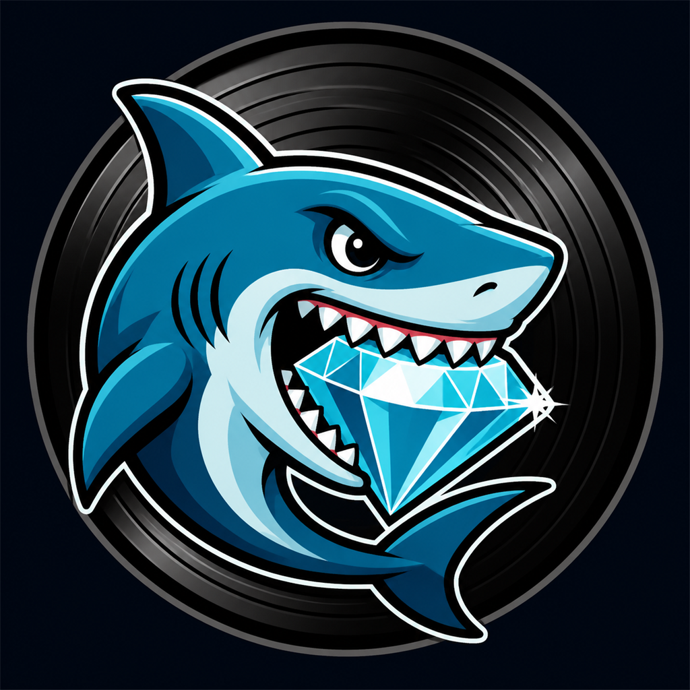

<p align="center"></p>

<h1 align="center">Discogs Deal Watcher</h1>

<p align="center"><strong>Find underpriced vinyl, catch rare restocks and scout valuable records outside your wantlist.</strong></p>

<p align="center">
  <a href="https://github.com/norsnors/discogs-deal-watcher/releases/latest"></a>
  <a href="https://github.com/norsnors/discogs-deal-watcher/actions/workflows/ci.yml"></a>
  <a href="https://github.com/norsnors/discogs-deal-watcher/releases"></a>
  <a href="https://github.com/norsnors/discogs-deal-watcher/releases/download/v1.3.0/Discogs-Deal-Watcher-Setup-1.3.0.exe"></a>
  <a href="https://github.com/norsnors/discogs-deal-watcher/releases/download/v1.3.0/Discogs-Deal-Watcher-1.3.0-mac.dmg"></a>
</p>

<p align="center">
  <a href="https://github.com/norsnors/discogs-deal-watcher/releases/download/v1.3.0/Discogs-Deal-Watcher-Setup-1.3.0.exe"><strong>Download for Windows</strong></a>
  · <a href="https://github.com/norsnors/discogs-deal-watcher/releases/download/v1.3.0/Discogs-Deal-Watcher-1.3.0-mac.dmg"><strong>Download for macOS</strong></a>
  · <a href="INSTALL.md">Install guide</a>
</p>

Discogs Deal Watcher is a desktop companion for record collectors. It combines your Discogs
wantlist, current marketplace listings, shipping, condition and sold-price references into a small
daily review queue. Buying always stays on Discogs and always remains manual.

## Three ways to find records

| View | What it finds |
|---|---|
| **Deals** | VG+ or better copies priced below their real market reference, including shipping, price drops and relists. |
| **Rare gems** | Wantlist releases that had zero copies for sale and have just returned to the market. |
| **Scout** | Valuable releases outside your wantlist, searched by Discogs style or genre and filtered by an estimated VG+ value. |

Scout excludes releases already on your wantlist. A result is only added when you explicitly press
**Add to wantlist**.

## Download

| Platform | Installer | Architecture |
|---|---|---|
| Windows | [Discogs-Deal-Watcher-Setup-1.3.0.exe](https://github.com/norsnors/discogs-deal-watcher/releases/download/v1.3.0/Discogs-Deal-Watcher-Setup-1.3.0.exe) | x64 |
| macOS | [Discogs-Deal-Watcher-1.3.0-mac.dmg](https://github.com/norsnors/discogs-deal-watcher/releases/download/v1.3.0/Discogs-Deal-Watcher-1.3.0-mac.dmg) | Universal: Intel + Apple Silicon |
| Verification | [SHA256SUMS.txt](https://github.com/norsnors/discogs-deal-watcher/releases/download/v1.3.0/SHA256SUMS.txt) | SHA-256 |

> [!IMPORTANT]
> The installers are currently unsigned. Windows can show a SmartScreen warning and macOS needs a
> one-time Gatekeeper override. The precise steps are in the [installation guide](INSTALL.md).

## Start in three steps

1. Install the app for your platform.
2. Enter your Discogs username and personal access token in the setup wizard.
3. Press **Scan wantlist**, then review **Deals**, **Rare gems** or start a **Scout** search.

A full scan can take several minutes for a large wantlist because Discogs rate-limits marketplace
requests. Results and sold medians are cached locally so later scans can reuse recent work.

## Built for an honest comparison

- Checks the actual media condition and prefers **VG+ or better**.
- Includes shipping when comparing a listing with its reference value.
- Uses sold medians where available and clearly labels weaker estimates.
- Tracks exact-listing price drops and relists over time.
- Explains why a result was selected instead of showing an unexplained score.
- Can refresh in the background while the desktop app is open.
- Supports optional 24/7 cloud alerts through your own GitHub account.

## Privacy and safety

- Your Discogs token is stored locally and is never exposed to the dashboard page.
- Marketplace requests and secrets stay in Electron's isolated main process.
- The app never adds a record to a cart and never completes a purchase.
- Scout changes your wantlist only after an explicit **Add to wantlist** click.
- The optional cloud watcher runs in your own accounts and can be disabled independently.

## Development

Requirements: Node.js 20+ and npm.

```powershell
git clone https://github.com/norsnors/discogs-deal-watcher.git
Set-Location discogs-deal-watcher
npm ci
npm run selftest

Set-Location dashboard
npm ci
npm start
```

### Build desktop installers

```powershell
# Windows x64 NSIS installer
npm run build

# macOS universal DMG — run this on macOS
npm run build:mac
```

Every push runs the test suite, dependency audits, a Docker build and a real Windows-installer build.
The manual desktop-release workflow builds Windows and macOS from the same version tag, verifies the
packaged resources and creates SHA-256 checksums before publishing.

## Documentation

- [Installation and first-run guide](INSTALL.md)
- [Technical architecture, detection logic and deployment reference](docs/TECHNICAL.md)
- [Release notes](RELEASE_NOTES.md)
- [Latest GitHub release](https://github.com/norsnors/discogs-deal-watcher/releases/latest)

Questions or a reproducible bug? [Open an issue](https://github.com/norsnors/discogs-deal-watcher/issues).
